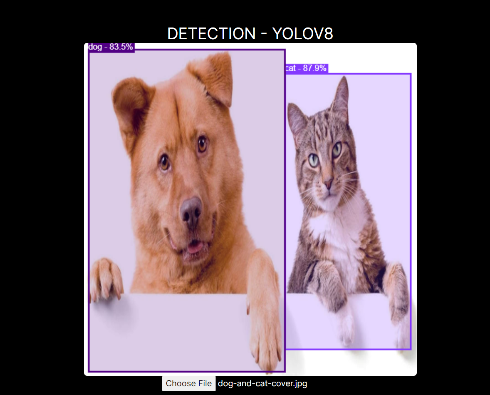

# web_model_deployment-emlo_a14
This is 14th assignment of course EMLO from TSAI

## Introduction
This project focuses on converting Yolov8 model into onnx using the model to run inference directly on web server.
<br>
Here we will using pre-trained YoloV8 model from Ultralytics converted into ONNX

## Model Conversion
Lets quicly go through the process of downloading and converting Yolov8 model into onnx.

```
#convert-model.sh
pip install torch==1.12.0+cpu torchvision==0.13.0+cpu torchaudio==0.12.0 --extra-index-url https://download.pytorch.org/whl/cpu
pip install 
pip install ultralytics
sudo apt update && sudo apt install libgl1
yolo export model=yolov8n.pt format=onnx
```
1. create a file `convert-model.sh` and add above code.
2. run the file `sudo sh convert-model.sh`
3. thats all! now you have a Yolov8 in onnx format.

## Running the server
just run `npm run dev` and the page should be visible on `localhost:3000`

## Output
Here is the input image

<br>
And here is the output image
